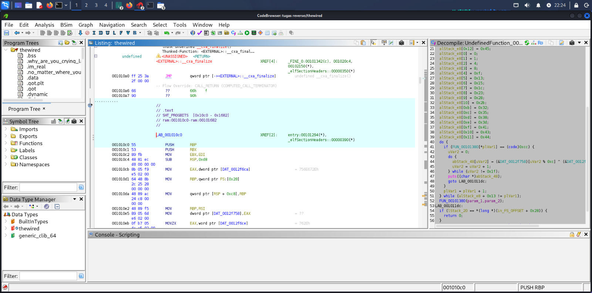
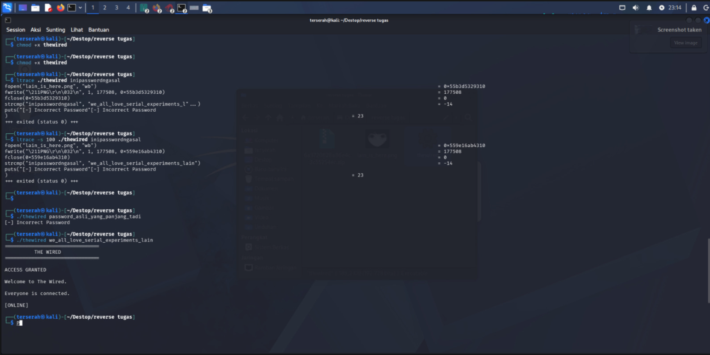

# writeup Creackme 01
Nama: RR7's Secret key
Tipe: C++ Console Application
Arsitektur: x86-64
Tools: Ghidra
Difficulty: 1.0 (Easy)

# 1. Analisis Statis (Triage)
Pada tahap awal, file dieksekusi menggunakan Static Analysis Tool (Ghidra) untuk mengidentifikasi alur kerja program.

-Metode: Dekompilasi binary menjadi kode representatif bahasa C.
-Temuan Awal: Program menggunakan fungsi standar printf dan scanf untuk interaksi pengguna.

# 2. Bedah Logika (Ghidra Decompiler)
Hasil dekompilasi menunjukkan adanya dua tahap pengecekan input yang bersifat hardcoded:

# Proses dalam Ghidra

# 3. Hasil Eksekusi (Dinamis)
Setelah mengetahui nilai yang diharapkan, dilakukan pengujian melalui Command Prompt untuk memverifikasi temuan:

# Hasil eksekusi menggunakan terminal

# 4. Kesimpulan
# Tantangan ini mengajarkan dasar-dasar reverse engineering di mana analis harus mampu melakukan konversi nilai antara heksadesimal ke desimal serta membaca alur logika program melalui dekompilator. 
Tantangan ini berhasil diselesaikan dengan metode analisis statis yang dikonfirmasi dengan pengujian dinamis
